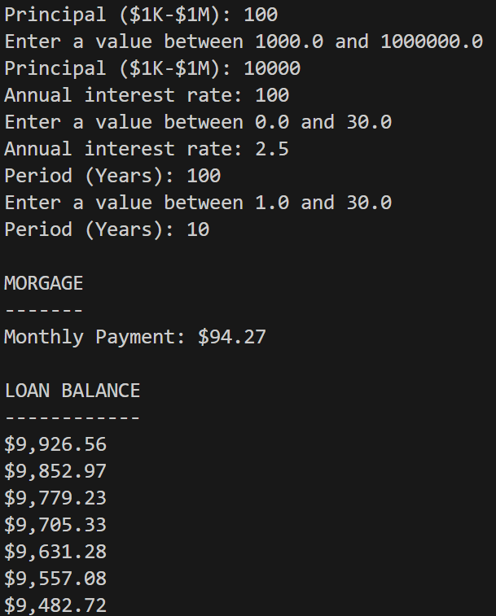
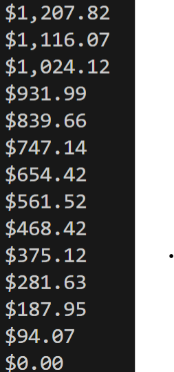

**Mortgage Calculator Application**

**Credits:** This project was part of the following tutorial series: https://codewithmosh.com/p/the-ultimate-java-mastery-series

**About this Project:**
A Mortgage Calculator Command Line Application written in Java following the Object Oriented Programming Paradigm

**Classes and their roles:**
1. **Main:** this class contains the main method in which objects of other classes are created (if required) and instance/static methods from other classes are called in an order which ensures that the different stages of the application (accepting user input, mortgage calculation, and report printing) are executed in the correct order.
2. **Console:** this class is responsible for reading an input from the user through the console.
3. **MortgageCalculator:** this class handles monthly payment and remaining loan balance calculations.
4. **MortgageReport:** this class is responsible for printing the monthly payment amount and the remaining loan balance after each payment.

**An example output:**  
 
. 
. 
. 
  
